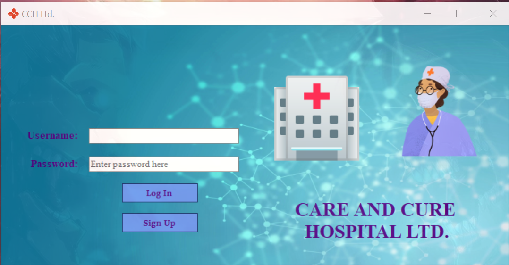

# Hospital_Management_System
Hospital Ward Management System. Used to allow users to keep track of hospital wards including the check in and check out dates of patients, the payments generated during this time, the availability of a particular ward and allows admin and regular users to have different permissions.

Implemented using C# with Windows Forms for the front end development. For the database, Oracle Express 10g was used. 
Uses PL/SQL for advanced queries. 

Implements the following topics from PL/SQL in the Oracle Database: 
    1. Functions
    2. Procedures
    3. Triggers

University project for Advanced Database Management Course.

Log In Screen:

